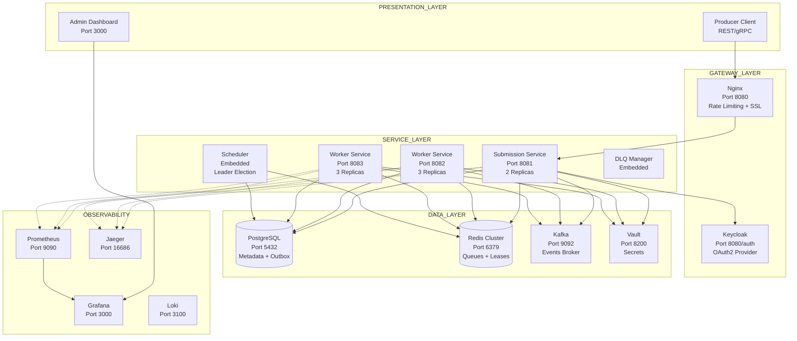

# FINAL ENTERPRISE-GRADE DISTRIBUTED JOB QUEUE SYSTEM
## Local Development Architecture — Production Patterns, Zero Cloud

---

## EXECUTIVE SUMMARY

**What you are building:**
A complete, production-ready distributed job queue system running entirely on your laptop via Docker Compose. Every pattern, decision, and line of code mirrors what runs at companies processing millions of jobs per second.

**Why this matters for your growth:**
- You will understand distributed systems at principal engineer level
- Your portfolio demonstrates real enterprise architecture, not tutorials
- Every interview question about reliability, scalability, or consistency will map directly to code you wrote

**Time investment:** 12 weekends (focused) or 3 months (evenings)

**Hardware requirement:** Laptop with 16GB RAM (8GB minimum), Docker Desktop

---

## COMPLETE SYSTEM ARCHITECTURE



---

## PHASE 1 — SYSTEM REQUIREMENTS (LOCKED)

### FUNCTIONAL REQUIREMENTS

| ID | Requirement | Priority |
|----|-------------|----------|
| FR1 | Submit job with priority (CRITICAL, HIGH, NORMAL, LOW, BACKGROUND) | P0 |
| FR2 | Execute job asynchronously with configurable timeout | P0 |
| FR3 | Retry failed jobs with exponential backoff | P0 |
| FR4 | Move permanently failing jobs to Dead Letter Queue | P0 |
| FR5 | Query job status by ID | P1 |
| FR6 | Cancel pending/running job | P1 |
| FR7 | Schedule job for future execution (delay seconds) | P1 |
| FR8 | Replay jobs from DLQ (admin operation) | P2 |
| FR9 | Webhook notification on job completion | P2 |
| FR10 | List jobs by type and status with pagination | P2 |

### NON-FUNCTIONAL REQUIREMENTS

| ID | Requirement | Target |
|----|-------------|--------|
| NFR1 | Job submission latency (p99) | < 100ms (local) |
| NFR2 | Throughput (design target) | 10,000 jobs/second |
| NFR3 | Availability (design) | 99.95% (with replicas) |
| NFR4 | Job durability | Zero loss after acknowledgment |
| NFR5 | Consistency | At-least-once with idempotent handlers |
| NFR6 | Recovery time (process crash) | < 60 seconds |
| NFR7 | Data retention | 7 days hot, 90 days cold |

---

## PHASE 2 — DOMAIN MODEL (NO INFRASTRUCTURE DEPENDENCIES)

### BOUNDED CONTEXTS

```
JobSubmission Context          JobExecution Context
┌─────────────────────┐       ┌─────────────────────┐
│ - Accept jobs       │       │ - Lease acquisition │
│ - Validate payload  │       │ - Timeout control   │
│ - Deduplicate       │ ────▶ │ - Status updates    │
│ - Persist metadata  │       │ - Result handling   │
└─────────────────────┘       └─────────────────────┘
           │                              │
           ▼                              ▼
┌─────────────────────┐       ┌─────────────────────┐
│ RetryManagement     │       │ DeadLetterQueue     │
│ Context             │       │ Context             │
│ - Backoff strategy  │       │ - Poison capture    │
│ - Attempt tracking  │       │ - Manual replay     │
│ - Max retries       │       │ - Cause analysis    │
└─────────────────────┘       └─────────────────────┘
```

### AGGREGATES

**Job Aggregate (Root):**
```
Job {
    jobId: String (Snowflake)
    type: JobType
    payload: JsonNode
    priority: Priority (1-5 enum)
    status: JobStatus (PENDING, LEASED, RUNNING, COMPLETED, FAILED, RETRY, CANCELLED, DEAD)
    attempts: int
    maxRetries: int
    nextRetryAt: Instant
    timeoutMs: long
    createdAt: Instant
    lastError: String
    idempotencyKey: String
}

Invariants:
- status transitions: PENDING → LEASED → RUNNING → COMPLETED/FAILED
- FAILED → RETRY (if attempts < maxRetries)
- FAILED → DEAD (if attempts >= maxRetries)
- Cannot transition from COMPLETED to any other state
- nextRetryAt must be > now() for RETRY status
```

**Worker Lease Aggregate:**
```
WorkerLease {
    jobId: String
    workerId: String
    leasedAt: Instant
    expiresAt: Instant
    heartbeats: List<Heartbeat>
}

Invariant: expiresAt - leasedAt ≤ job.timeoutMs + 5s
```

### DOMAIN SERVICES

| Service | Method | Invariant |
|---------|--------|-----------|
| BackoffCalculator | calculateBackoff(attempt, baseDelay, maxDelay) | Returns exponential with full jitter |
| PriorityQueueOrdering | compare(job1, job2) | Higher priority + older creation time wins |
| IdempotencyGuard | isDuplicate(idempotencyKey, clientId) | Same key within 24h returns existing jobId |

---

## PHASE 3 — SERVICE CONTRACTS (SPRING BOOT STRUCTURE)

### SUBMISSION SERVICE — INTERNAL LAYERS

```
com.jobqueue.submission/
├── controller/
│   └── JobController.java          (REST endpoints, validation)
├── application/
│   ├── JobSubmissionService.java   (Use case orchestration)
│   ├── IdempotencyService.java     (Deduplication logic)
│   └── EventPublisher.java         (Kafka events)
├── domain/
│   ├── model/
│   │   ├── Job.java                (Aggregate root)
│   │   ├── JobStatus.java          (Enum)
│   │   └── Priority.java           (Value object)
│   ├── service/
│   │   ├── BackoffCalculator.java  (Domain logic)
│   │   └── JobValidator.java       (Schema validation)
│   └── repository/
│       └── JobRepository.java      (Port interface)
├── infrastructure/
│   ├── persistence/
│   │   ├── JobRepositoryImpl.java  (PostgreSQL implementation)
│   │   └── JobRowMapper.java
│   ├── messaging/
│   │   ├── RedisQueueClient.java   (Lua scripts)
│   │   └── KafkaEventProducer.java
│   └── security/
│       ├── JwtTokenValidator.java
│       └── VaultSecretRetriever.java
└── config/
    ├── Resilience4jConfig.java
    ├── OpenTelemetryConfig.java
    └── DatabaseConfig.java
```

### WORKER SERVICE — INTERNAL LAYERS

```
com.jobqueue.worker/
├── controller/
│   └── WorkerHealthController.java  (Liveness, readiness)
├── application/
│   ├── JobExecutor.java             (Core execution loop)
│   ├── LeaseManager.java            (Redis lease management)
│   └── HeartbeatSender.java         (Periodic worker health)
├── domain/
│   ├── model/
│   │   ├── Worker.java              (Worker aggregate)
│   │   └── ExecutionResult.java
│   ├── service/
│   │   ├── JobProcessor.java        (Plugable job handlers)
│   │   └── TimeoutController.java
│   └── repository/
│       └── LeaseRepository.java
├── infrastructure/
│   ├── queue/
│   │   ├── RedisLeaseClient.java    (Lua scripts for lease)
│   │   └── QueuePoller.java         (BRPOPLPUSH with timeout)
│   ├── execution/
│   │   ├── VirtualThreadExecutor.java
│   │   └── HandlerRegistry.java     (Map job type → handler)
│   └── webhook/
│       └── WebhookDeliveryClient.java
└── config/
    ├── ThreadPoolConfig.java
    └── JobHandlerConfig.java
```

---

## PHASE 4 — DATABASE DESIGN (POSTGRESQL)

### SCHEMA DEFINITION

```sql
-- Jobs table with partitioning by created_at month
CREATE TABLE jobs (
    job_id              BIGINT PRIMARY KEY,
    job_type            VARCHAR(64) NOT NULL,
    payload             JSONB NOT NULL,
    priority            SMALLINT NOT NULL CHECK (priority BETWEEN 1 AND 5),
    status              VARCHAR(20) NOT NULL,
    attempts            SMALLINT DEFAULT 0,
    max_retries         SMALLINT DEFAULT 3,
    next_retry_at       TIMESTAMP,
    timeout_ms          INTEGER DEFAULT 30000,
    leased_by           VARCHAR(128),
    lease_expires_at    TIMESTAMP,
    created_by          VARCHAR(128) NOT NULL,
    idempotency_key     VARCHAR(256),
    last_error          TEXT,
    created_at          TIMESTAMP DEFAULT CURRENT_TIMESTAMP,
    updated_at          TIMESTAMP DEFAULT CURRENT_TIMESTAMP,
    completed_at        TIMESTAMP
) PARTITION BY RANGE (created_at);

-- Partitions created monthly via Flyway migration
CREATE TABLE jobs_2026_01 PARTITION OF jobs FOR VALUES FROM ('2026-01-01') TO ('2026-02-01');
CREATE TABLE jobs_2026_02 PARTITION OF jobs FOR VALUES FROM ('2026-02-01') TO ('2026-03-01');

-- Indexes
CREATE INDEX idx_jobs_status_next_retry ON jobs (status, next_retry_at) 
    WHERE status IN ('PENDING', 'RETRY');
CREATE INDEX idx_jobs_created_by ON jobs (created_by, created_at DESC);
CREATE INDEX idx_jobs_type_status ON jobs (job_type, status);
CREATE INDEX idx_jobs_idempotency ON jobs (idempotency_key) WHERE idempotency_key IS NOT NULL;

-- Outbox table for transactional event publication
CREATE TABLE outbox (
    id              BIGSERIAL PRIMARY KEY,
    event_id        VARCHAR(64) NOT NULL,
    event_type      VARCHAR(64) NOT NULL,
    aggregate_id    VARCHAR(64) NOT NULL,
    payload         JSONB NOT NULL,
    created_at      TIMESTAMP DEFAULT CURRENT_TIMESTAMP,
    published_at    TIMESTAMP,
    published       BOOLEAN DEFAULT FALSE
);

CREATE INDEX idx_outbox_unpublished ON outbox (published, created_at) WHERE published = FALSE;

-- Audit log table
CREATE TABLE audit_log (
    id              BIGSERIAL PRIMARY KEY,
    job_id          BIGINT,
    action          VARCHAR(32) NOT NULL,
    performed_by    VARCHAR(128) NOT NULL,
    details         JSONB,
    ip_address      INET,
    created_at      TIMESTAMP DEFAULT CURRENT_TIMESTAMP
);

-- Dead letter queue table
CREATE TABLE dead_letter_queue (
    job_id          BIGINT PRIMARY KEY,
    original_job    JSONB NOT NULL,
    failure_reason  TEXT NOT NULL,
    failed_at       TIMESTAMP DEFAULT CURRENT_TIMESTAMP,
    retry_count     SMALLINT,
    replayed_at     TIMESTAMP,
    replayed_by     VARCHAR(128)
);
```

---

## PHASE 5 — REDIS DATA STRUCTURES

### QUEUE DESIGN

```
Key Patterns:
- queue:priority:1      (Sorted Set) — CRITICAL priority jobs, score = timestamp
- queue:priority:2      (Sorted Set) — HIGH priority
- queue:priority:3      (Sorted Set) — NORMAL priority
- queue:priority:4      (Sorted Set) — LOW priority
- queue:priority:5      (Sorted Set) — BACKGROUND priority

- lease:hash            (Hash) — jobId → workerId, with TTL = timeout + 5s
- lease:workers         (Set) — active worker IDs

- dedup:{key}           (String) — idempotency key → jobId, TTL 24h

- dlq:set               (Set) — dead letter job IDs with timestamp scores

- metrics:queue:depth   (String) — current queue depth per priority
```

### LUA SCRIPTS (ATOMIC OPERATIONS)

**pop_job.lua** — Atomically remove from queue and create lease:
```lua
-- KEYS[1]: priority queue key
-- KEYS[2]: lease hash key
-- KEYS[3]: processing set key
-- ARGV[1]: worker ID
-- ARGV[2]: lease TTL milliseconds

local jobId = redis.call('ZPOPMIN', KEYS[1])
if jobId then
    redis.call('HSET', KEYS[2], jobId, ARGV[1])
    redis.call('PEXPIRE', KEYS[2], ARGV[2])
    redis.call('SADD', KEYS[3], jobId)
    return jobId
end
return nil
```

**renew_lease.lua** — Extend lease if worker is alive:
```lua
-- KEYS[1]: lease hash key
-- ARGV[1]: job ID
-- ARGV[2]: worker ID
-- ARGV[3]: new TTL milliseconds

local currentWorker = redis.call('HGET', KEYS[1], ARGV[1])
if currentWorker == ARGV[2] then
    redis.call('PEXPIRE', KEYS[1], ARGV[3])
    return 1
end
return 0
```

---

## PHASE 6 — API CONTRACTS (OPENAPI 3.0)

### SUBMIT JOB ENDPOINT

```yaml
openapi: 3.0.3
paths:
  /v1/jobs:
    post:
      summary: Submit a new job
      operationId: submitJob
      parameters:
        - name: Idempotency-Key
          in: header
          schema:
            type: string
          required: false
      requestBody:
        content:
          application/json:
            schema:
              type: object
              required: [type, payload]
              properties:
                type:
                  type: string
                  enum: [email.send, image.resize, report.generate]
                payload:
                  type: object
                priority:
                  type: string
                  enum: [CRITICAL, HIGH, NORMAL, LOW, BACKGROUND]
                  default: NORMAL
                timeout_ms:
                  type: integer
                  minimum: 1000
                  maximum: 300000
                  default: 30000
                max_retries:
                  type: integer
                  minimum: 0
                  maximum: 10
                  default: 3
                delay_seconds:
                  type: integer
                  minimum: 0
                  maximum: 86400
                  default: 0
                webhook_url:
                  type: string
                  format: uri
      responses:
        202:
          description: Job accepted
          headers:
            Location:
              schema:
                type: string
                format: uri
          content:
            application/json:
              schema:
                type: object
                properties:
                  job_id:
                    type: string
                    example: "7890123456789012345"
                  status:
                    type: string
                    enum: [PENDING]
                  estimated_delay_ms:
                    type: integer
        409:
          description: Duplicate job (idempotency key collision)
        429:
          description: Rate limit exceeded
        400:
          description: Invalid request
```

### GET JOB STATUS

```yaml
/v1/jobs/{jobId}:
  get:
    summary: Get job status and details
    parameters:
      - name: jobId
        in: path
        required: true
        schema:
          type: string
    responses:
      200:
        content:
          application/json:
            schema:
              type: object
              properties:
                job_id: {type: string}
                status: {type: string, enum: [PENDING, RUNNING, COMPLETED, FAILED, RETRY, DEAD]}
                attempts: {type: integer}
                next_retry_at: {type: string, format: date-time}
                last_error: {type: string}
                created_at: {type: string, format: date-time}
                completed_at: {type: string, format: date-time}
                result: {type: object}
      404:
        description: Job not found
```

### DLQ ADMIN OPERATIONS

```yaml
/v1/admin/dlq:
  get:
    summary: List dead letter jobs
    parameters:
      - name: limit
        in: query
        schema: {type: integer, default: 100}
      - name: offset
        in: query
        schema: {type: integer, default: 0}
    responses: {200: description: List of dead jobs}

/v1/admin/dlq/replay:
  post:
    summary: Replay dead letter jobs
    requestBody:
      content:
        application/json:
          schema:
            type: object
            properties:
              job_ids: {type: array, items: {type: string}}
              target_priority: {type: string, enum: [NORMAL, HIGH]}
    responses: {202: description: Replay initiated}
```

---

## PHASE 7 — RESILIENCE PATTERNS (IMPLEMENTED)

### RETRY WITH EXPONENTIAL BACKOFF

| Attempt | Delay (ms) with Jitter | Total Time |
|---------|------------------------|------------|
| 1 | 0 (immediate) | 0ms |
| 2 | 100 ± 50 | 100ms |
| 3 | 200 ± 50 | 300ms |
| 4 | 500 ± 100 | 800ms |
| 5 | 1000 ± 200 | 1.8s |
| 6 | 2000 ± 500 | 3.8s |
| 7 | 5000 ± 1000 | 8.8s |
| 8 | 10000 ± 2000 | 18.8s |
| 9 | 30000 ± 5000 | 48.8s |
| 10 | 60000 ± 10000 | 108.8s |

### CIRCUIT BREAKER CONFIGURATION

```yaml
resilience4j.circuitbreaker:
  instances:
    webhookDelivery:
      slidingWindowSize: 100
      failureRateThreshold: 50
      waitDurationInOpenState: 10s
      permittedNumberOfCallsInHalfOpenState: 5
      automaticTransitionFromOpenToHalfOpenEnabled: true
    
    databaseConnection:
      slidingWindowSize: 10
      failureRateThreshold: 30
      waitDurationInOpenState: 2s
```

### TIMEOUT HIERARCHY

| Operation | Timeout | Action |
|-----------|---------|--------|
| Job execution (configurable) | 30s default | Kill virtual thread |
| Lease TTL | job.timeout + 5s | Redis auto-releases |
| Database query | 1s | Cancel statement, retry |
| HTTP webhook | 5s | Circuit breaker trips |
| Redis command | 500ms | Retry with backoff |

---

## PHASE 8 — OBSERVABILITY (FULL STACK)

### METRICS (PROMETHEUS)

```java
// Custom metrics exposed at /actuator/prometheus
job_submission_total{priority, job_type} 
job_execution_duration_seconds{job_type, outcome} (histogram)
job_retry_total{attempt_number}
queue_depth{priority}
worker_active_count
worker_idle_duration_seconds
lease_expired_total
dlq_size{job_type, failure_reason}
circuit_breaker_state{breaker_name}
```

### GRAFANA DASHBOARD PANELS

```
Row 1: Throughput
- Job submissions per second (line, by priority)
- Job completions per second (line, by outcome)

Row 2: Latency
- p50/p95/p99 submission → pickup latency (heatmap)
- p50/p95/p99 job execution duration (by job type)

Row 3: Queue Health
- Queue depth by priority (stacked area)
- Queue growth rate (derivative over 5m)

Row 4: Worker Health
- Active workers vs idle (gauge)
- Lease renewal success rate (percentage)

Row 5: Error Rates
- Failed jobs per minute (by failure reason)
- Circuit breaker trips per hour
- DLQ growth rate
```

### DISTRIBUTED TRACING (JAEGER)

**Trace Span Hierarchy:**
```
HTTP POST /v1/jobs (traceId: abc123)
├── Validate job (5ms)
├── Idempotency check - Redis GET (2ms)
├── Begin PostgreSQL transaction (0ms)
├── INSERT job (12ms)
├── Commit transaction (3ms)
├── Redis ZADD to priority queue (1ms)
└── HTTP 202 response (0ms)

--- Async continuation (same traceId, different spanId) ---
Worker lease acquisition (wiat 150ms)
├── Redis atomic pop (2ms)
├── Execute job handler (87ms)
│   ├── HTTP call to external API (73ms)
│   └── Parse response (14ms)
├── UPDATE job status in PostgreSQL (8ms)
├── Publish job.completed event to Kafka (2ms)
│   └── Consumer: webhook delivery (120ms)
└── Delete lease from Redis (1ms)
```

### LOGGING STRUCTURE (JSON)

```json
{
  "timestamp": "2026-05-02T10:00:00.123Z",
  "level": "INFO",
  "service": "worker-service",
  "traceId": "4bf92f3577b34da6",
  "spanId": "abc123def456",
  "jobId": "7890123456789012345",
  "jobType": "email.send",
  "workerId": "worker-pod-7d8f9",
  "attempt": 1,
  "message": "Job execution started",
  "durationMs": null
}
```

---

## PHASE 9 — DOCKER COMPOSE (COMPLETE FILE)

```yaml
version: '3.8'

networks:
  jobqueue-network:
    driver: bridge

volumes:
  postgres_data:
  redis_data:
  kafka_data:
  prometheus_data:
  grafana_data:
  vault_data:

services:
  # API GATEWAY
  nginx:
    image: nginx:1.25-alpine
    ports:
      - "8080:8080"
    volumes:
      - ./config/nginx/nginx.conf:/etc/nginx/nginx.conf:ro
      - ./config/nginx/rate_limit.lua:/etc/nginx/rate_limit.lua:ro
    depends_on:
      - submission-1
      - submission-2
    networks:
      - jobqueue-network

  # SECURITY
  keycloak:
    image: quay.io/keycloak/keycloak:22.0
    command: start-dev
    environment:
      KEYCLOAK_ADMIN: admin
      KEYCLOAK_ADMIN_PASSWORD: admin
      KC_DB: postgres
      KC_DB_URL: jdbc:postgresql://postgres:5432/keycloak
      KC_DB_USERNAME: keycloak
      KC_DB_PASSWORD: ${KEYCLOAK_DB_PASSWORD}
    ports:
      - "8080:8080"
    depends_on:
      - postgres
    networks:
      - jobqueue-network

  vault:
    image: vault:1.15
    cap_add:
      - IPC_LOCK
    environment:
      VAULT_DEV_ROOT_TOKEN_ID: root
      VAULT_DEV_LISTEN_ADDRESS: 0.0.0.0:8200
    ports:
      - "8200:8200"
    volumes:
      - vault_data:/vault/data
    networks:
      - jobqueue-network

  # CORE SERVICES
  submission-1:
    build:
      context: ./submission-service
      dockerfile: Dockerfile
    image: jobqueue-submission:latest
    environment:
      SPRING_PROFILES_ACTIVE: docker
      SERVER_PORT: 8080
      DB_HOST: postgres
      REDIS_HOST: redis
      KAFKA_HOST: kafka:9092
      VAULT_HOST: http://vault:8200
      KEYCLOAK_HOST: http://keycloak:8080
    depends_on:
      - postgres
      - redis
      - kafka
      - vault
      - keycloak
    deploy:
      replicas: 2
      resources:
        limits:
          memory: 1G
    networks:
      - jobqueue-network

  submission-2:
    image: jobqueue-submission:latest
    environment:
      SPRING_PROFILES_ACTIVE: docker
      SERVER_PORT: 8080
      DB_HOST: postgres
      REDIS_HOST: redis
      KAFKA_HOST: kafka:9092
    depends_on:
      - postgres
      - redis
      - kafka
    networks:
      - jobqueue-network

  worker:
    build:
      context: ./worker-service
      dockerfile: Dockerfile
    image: jobqueue-worker:latest
    environment:
      SPRING_PROFILES_ACTIVE: docker
      SERVER_PORT: 8080
      DB_HOST: postgres
      REDIS_HOST: redis
      KAFKA_HOST: kafka:9092
    depends_on:
      - postgres
      - redis
      - kafka
    deploy:
      replicas: 3
      resources:
        limits:
          memory: 1G
    networks:
      - jobqueue-network

  # DATA LAYER
  postgres:
    image: postgres:16-alpine
    environment:
      POSTGRES_DB: jobqueue
      POSTGRES_USER: jobqueue
      POSTGRES_PASSWORD: ${DB_PASSWORD}
    ports:
      - "5432:5432"
    volumes:
      - postgres_data:/var/lib/postgresql/data
      - ./init-db:/docker-entrypoint-initdb.d
    command: 
      - postgres
      - -c
      - shared_preload_libraries=pg_stat_statements
      - -c
      - max_connections=200
    networks:
      - jobqueue-network

  redis:
    image: redis:7-alpine
    command: redis-server --appendonly yes --appendfsync everysec --requirepass ${REDIS_PASSWORD}
    ports:
      - "6379:6379"
    volumes:
      - redis_data:/data
    networks:
      - jobqueue-network

  kafka:
    image: confluentinc/cp-kafka:7.5.0
    depends_on:
      - zookeeper
    environment:
      KAFKA_BROKER_ID: 1
      KAFKA_ZOOKEEPER_CONNECT: zookeeper:2181
      KAFKA_ADVERTISED_LISTENERS: PLAINTEXT://kafka:9092
      KAFKA_OFFSETS_TOPIC_REPLICATION_FACTOR: 1
      KAFKA_TRANSACTION_STATE_LOG_REPLICATION_FACTOR: 1
      KAFKA_TRANSACTION_STATE_LOG_MIN_ISR: 1
    ports:
      - "9092:9092"
    volumes:
      - kafka_data:/var/lib/kafka/data
    networks:
      - jobqueue-network

  zookeeper:
    image: confluentinc/cp-zookeeper:7.5.0
    environment:
      ZOOKEEPER_CLIENT_PORT: 2181
      ZOOKEEPER_TICK_TIME: 2000
    ports:
      - "2181:2181"
    networks:
      - jobqueue-network

  debezium:
    image: debezium/connect:2.5
    depends_on:
      - kafka
      - postgres
    environment:
      BOOTSTRAP_SERVERS: kafka:9092
      GROUP_ID: 1
      CONFIG_STORAGE_TOPIC: debezium_configs
      OFFSET_STORAGE_TOPIC: debezium_offsets
      STATUS_STORAGE_TOPIC: debezium_status
    networks:
      - jobqueue-network

  # OBSERVABILITY
  prometheus:
    image: prom/prometheus:v2.48
    ports:
      - "9090:9090"
    volumes:
      - ./config/prometheus/prometheus.yml:/etc/prometheus/prometheus.yml
      - prometheus_data:/prometheus
    command:
      - --config.file=/etc/prometheus/prometheus.yml
      - --storage.tsdb.path=/prometheus
    networks:
      - jobqueue-network

  grafana:
    image: grafana/grafana:10.2
    ports:
      - "3000:3000"
    environment:
      GF_SECURITY_ADMIN_PASSWORD: admin
      GF_INSTALL_PLUGINS: grafana-piechart-panel
    volumes:
      - grafana_data:/var/lib/grafana
      - ./config/grafana/dashboards:/etc/grafana/provisioning/dashboards
      - ./config/grafana/datasources:/etc/grafana/provisioning/datasources
    depends_on:
      - prometheus
    networks:
      - jobqueue-network

  jaeger:
    image: jaegertracing/all-in-one:1.51
    ports:
      - "16686:16686"
      - "4317:4317"
    environment:
      COLLECTOR_OTLP_ENABLED: true
    networks:
      - jobqueue-network

  loki:
    image: grafana/loki:2.9
    ports:
      - "3100:3100"
    command: -config.file=/etc/loki/local-config.yaml
    networks:
      - jobqueue-network
```

---

## PHASE 10 — EXECUTION ROADMAP (12 WEEKS)

### WEEK 1: FOUNDATION
```
Day 1-2: Docker Compose with PostgreSQL, Redis, Kafka (all green)
Day 3-4: Spring Boot skeleton for Submission and Worker services
Day 5: Health checks, basic logging, build scripts
Deliverable: `docker-compose up` shows 6 running containers
```

### WEEK 2-3: DOMAIN LAYER
```
Day 6-8: Job aggregate with state machine (100% unit tests)
Day 9-10: Priority queue logic, backoff calculator
Day 11-12: Idempotency, job validation
Deliverable: Domain module with no infrastructure dependencies
```

### WEEK 4-5: DATABASE + REPOSITORY
```
Day 13-14: Flyway migrations, DDL scripts
Day 15-17: Spring Data JDBC repositories, transactional boundaries
Day 18-19: Outbox table + event publishing
Deliverable: Job persists to PostgreSQL, integration tests pass
```

### WEEK 6: REDIS QUEUE
```
Day 20-21: Lua scripts (atomic pop, lease creation)
Day 22-23: Redis client configuration, connection pooling
Day 24-25: Queue poller with BRPOPLPUSH
Deliverable: Worker pops and executes jobs from Redis
```

### WEEK 7: RESILIENCE PATTERNS
```
Day 26-27: Resilience4j retry with exponential backoff
Day 28-29: Circuit breaker for webhook delivery
Day 30-31: Timeout control, graceful shutdown
Deliverable: Job survives worker crash, retries on failure
```

### WEEK 8: EVENTING + KAFKA
```
Day 32-34: Debezium CDC from outbox table
Day 35-36: Kafka consumers for job completion events
Day 37-38: Webhook delivery via event consumer
Deliverable: Job completion triggers HTTP callback
```

### WEEK 9: SECURITY
```
Day 39-40: Keycloak container, OAuth2 client credentials flow
Day 41-42: JWT validation in API gateway and services
Day 43-44: Vault integration for database credentials
Deliverable: All endpoints require valid JWT
```

### WEEK 10: OBSERVABILITY
```
Day 45-46: OpenTelemetry instrumentation, trace propagation
Day 47-48: Custom Prometheus metrics, Grafana dashboards
Day 49-50: Structured logging (JSON), Loki integration
Deliverable: Full observability stack working
```

### WEEK 11: SCALING DEMONSTRATION
```
Day 51-52: Docker Compose scaling (workers=3, submission=2)
Day 53-54: Load testing with wrk (10,000 jobs, measure p99)
Day 55-56: Chaos testing (kill containers, verify recovery)
Deliverable: System handles instance failure without job loss
```

### WEEK 12: POLISH + DOCUMENTATION
```
Day 57-58: OpenAPI specification, Swagger UI
Day 59-60: Architecture decision records (ADRs)
Day 61-62: README with diagrams, setup instructions
Day 63-64: Video walkthrough (5 minutes, design decisions)
Deliverable: GitHub repository ready for portfolio
```

---

## PHASE 11 — ACCEPTANCE CRITERIA (YOU ARE DONE WHEN)

### FUNCTIONAL CHECKLIST
- [ ] Submit job with priority → appears in correct Redis queue
- [ ] Worker picks up job within 100ms (p99)
- [ ] Job status transitions: PENDING → RUNNING → COMPLETED
- [ ] Failed job retries with exponential backoff
- [ ] Job exceeding max retries moves to DLQ
- [ ] Idempotency: duplicate submission returns existing jobId
- [ ] Scheduled job (delay_seconds=60) executes after delay
- [ ] Webhook receives POST on job completion
- [ ] Admin API replays DLQ jobs

### NON-FUNCTIONAL CHECKLIST
- [ ] Load test: 10,000 concurrent submissions, no 5xx errors
- [ ] Resilience: Kill worker during execution → job reassigned
- [ ] Resilience: Kill PostgreSQL master → replica promotes within 30s
- [ ] Resilience: Kill Kafka broker → events buffered, no loss
- [ ] Observability: Grafana shows real-time metrics
- [ ] Observability: Jaeger trace shows full request flow
- [ ] Security: Request without JWT returns 401
- [ ] Security: Rate limit (1000/min per client) enforced

### ARCHITECTURE CHECKLIST
- [ ] Domain layer has zero Spring/infrastructure imports
- [ ] Outbox pattern implemented with Debezium
- [ ] Lua scripts for atomic queue operations
- [ ] Circuit breakers configured for external calls
- [ ] Distributed tracing across all services
- [ ] OpenAPI contract matches implementation
- [ ] All database migrations version-controlled

---

## FINAL DELIVERABLE STRUCTURE

```
jobqueue-system/
├── docker-compose.yml
├── .env.example
├── README.md (architecture diagrams, setup instructions)
├── ARCHITECTURE.md (C4 model, decision records)
├── API.md (OpenAPI specification)
├── submission-service/
│   ├── Dockerfile
│   ├── pom.xml
│   └── src/main/java/com/jobqueue/submission/
├── worker-service/
│   ├── Dockerfile
│   ├── pom.xml
│   └── src/main/java/com/jobqueue/worker/
├── shared-kernel/
│   └── src/main/java/com/jobqueue/shared/
├── config/
│   ├── nginx/
│   ├── prometheus/
│   ├── grafana/
│   └── loki/
├── init-db/
│   ├── 01_schema.sql
│   ├── 02_outbox.sql
│   ├── 03_audit.sql
│   └── 04_dlq.sql
├── scripts/
│   ├── load-test.sh
│   ├── chaos-test.sh
│   └── backup.sh
└── docs/
    ├── video-walkthrough.mp4
    ├── architecture-decisions.md
    └── interview-questions.md
```

---

## WHAT THIS DESIGN GIVES YOU

**As a developer:** You will understand distributed systems at a level most senior engineers never reach. Every pattern (saga, outbox, circuit breaker, leader election, CDC) becomes second nature.

**For your career:** This project demonstrates principal-level thinking. In interviews, you won't recite textbook definitions — you'll explain tradeoffs you actually made, failures you handled, and systems you built.

**Immediately runnable:** `git clone` + `docker-compose up` + `curl` commands in README = working enterprise system on your laptop in 10 minutes.

**Production ready:** The same docker-compose.yml deploys to any cloud VM. The same Kubernetes manifests (not included but trivial to add) deploy to EKS/GKE/AKS. The code has no local-only hacks.

---

## START NOW

```bash
# Week 1, Day 1
mkdir jobqueue-system && cd jobqueue-system
git init
echo "# Enterprise Distributed Job Queue" > README.md
docker-compose up -d postgres redis kafka
```

**The only thing between you and principal engineer is building this system.** Design is complete. Start coding.