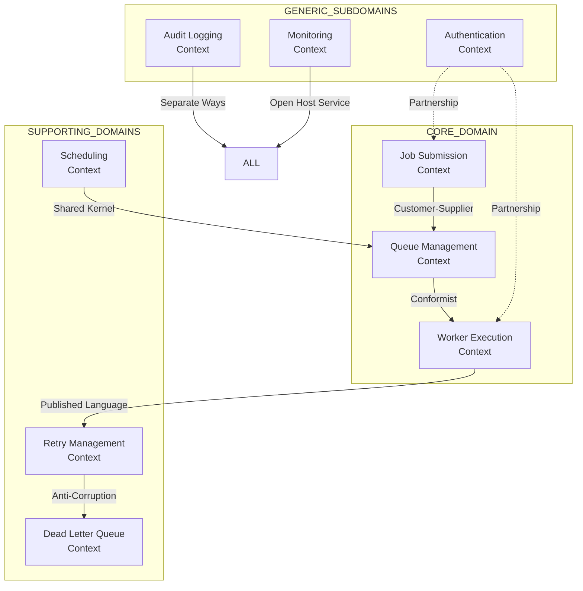
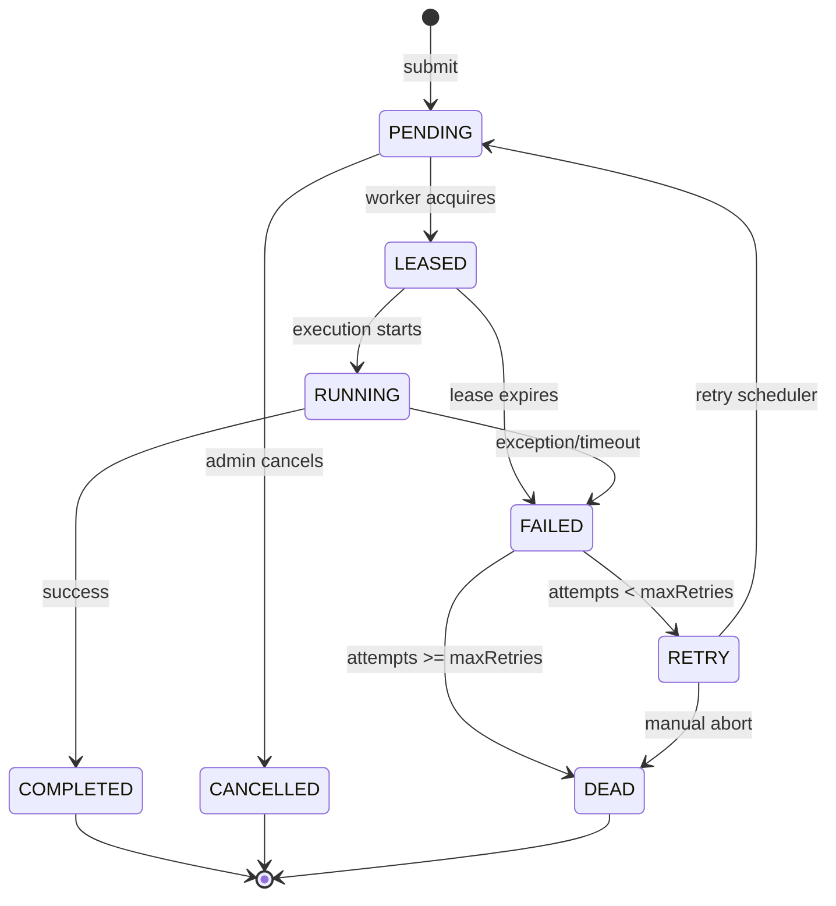
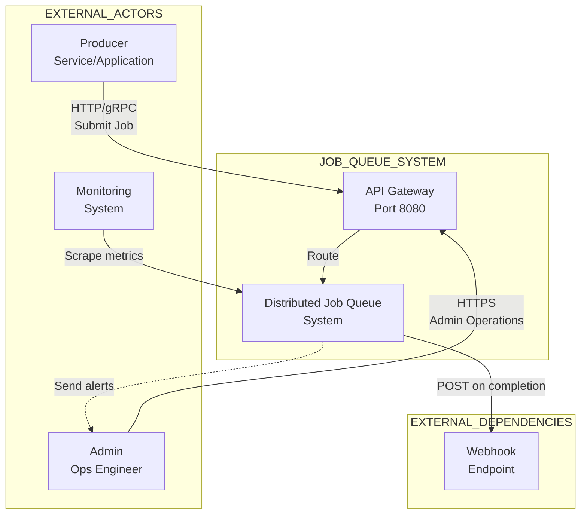
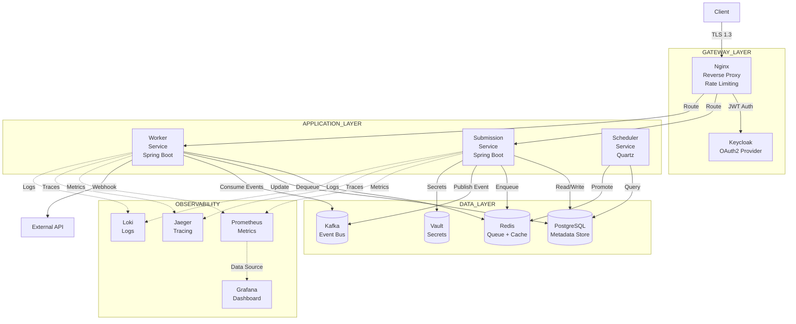
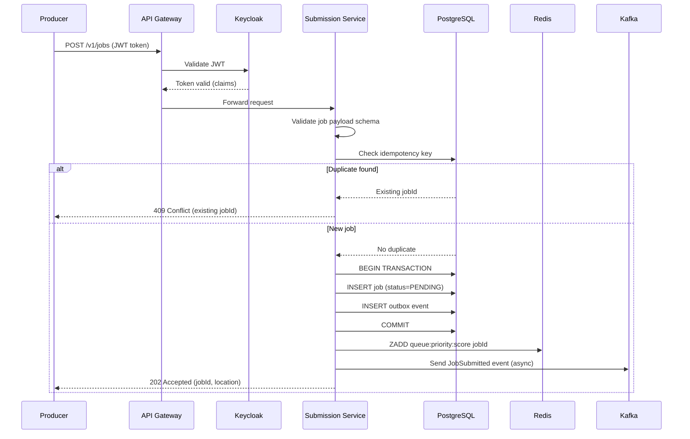
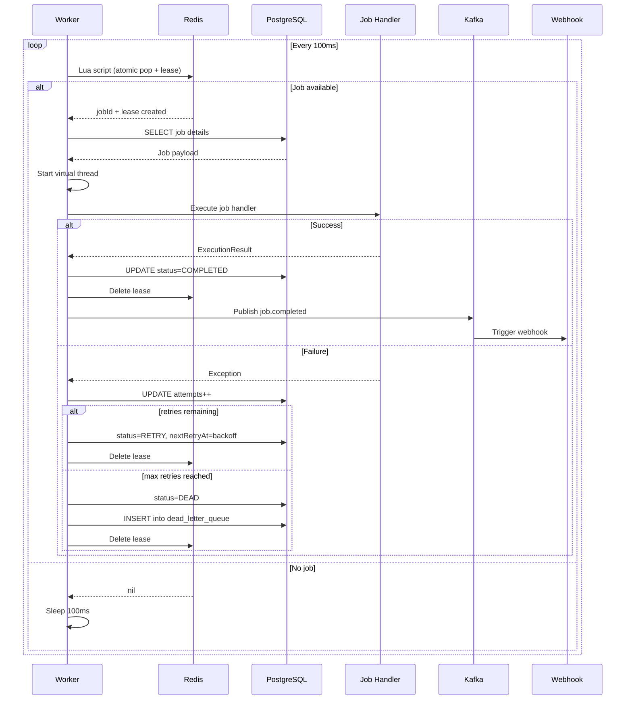
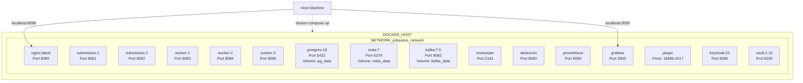

# FINAL ENTERPRISE-GRADE DISTRIBUTED JOB QUEUE SYSTEM
## Complete System Architecture + Domain-Driven Design + High-Level Design + Low-Level Design

---

# PART 1 — DOMAIN-DRIVEN DESIGN (DDD)

## 1.1 STRATEGIC DDD — BOUNDED CONTEXTS MAP



## 1.2 CONTEXT BY CONTEXT DETAIL

### CONTEXT 1: JOB SUBMISSION

```
Purpose: Accept, validate, and persist incoming jobs
Ownership: Submission Service team
Domain Events:
  - JobSubmitted (jobId, type, priority, timestamp)
  - JobRejected (jobId, reason, validationErrors)
  
Commands:
  - SubmitJob(jobData, idempotencyKey)
  - CancelJob(jobId)
  
Business Rules:
  1. Idempotency key must be unique per client within 24 hours
  2. Job schema must match registered type definition
  3. Rate limits per client: 1000 jobs/minute
  4. Payload size cannot exceed 1MB
  
Aggregates:
  - Job (root)
  - IdempotencyRecord
```

### CONTEXT 2: QUEUE MANAGEMENT

```
Purpose: Order jobs by priority and manage dequeue operations
Ownership: Platform team
Domain Events:
  - JobEnqueued (jobId, priority, position)
  - JobDequeued (jobId, workerId, leaseExpiry)
  
Commands:
  - EnqueueJob(jobId, priority)
  - DequeueJob(workerId, priorityRange)
  - RequeueJob(jobId, newPriority)
  
Business Rules:
  1. CRITICAL priority jobs must be dequeued before any other priority
  2. Within same priority, FIFO ordering (enqueue timestamp)
  3. Lease duration = job.timeout + 5 seconds
  4. No job can be dequeued twice without completion/failure
  
Aggregates:
  - PriorityQueue (value object)
  - Lease (entity, expires after TTL)
```

### CONTEXT 3: WORKER EXECUTION

```
Purpose: Lease jobs, execute handlers, report results
Ownership: Worker Service team
Domain Events:
  - JobLeased (jobId, workerId, leaseExpiry)
  - JobCompleted (jobId, result, duration)
  - JobFailed (jobId, error, attemptNumber)
  
Commands:
  - AcquireLease(jobId, workerId)
  - ExecuteJob(jobId, handler)
  - RenewLease(jobId, workerId)
  - ReleaseLease(jobId, workerId, outcome)
  
Business Rules:
  1. Worker must send heartbeat every 10 seconds
  2. Lease expiry without completion = auto-release
  3. Job handler must complete within timeout
  4. Idempotent handlers required (at-least-once delivery)
  
Aggregates:
  - Worker (root, tracks capacity)
  - Lease (value object, owned by Job)
```

## 1.3 TACTICAL DDD — AGGREGATES DESIGN

### JOB AGGREGATE (ROOT)

```yaml
Aggregate: Job
Repository: JobRepository
Transaction boundary: Entire aggregate

Attributes:
  - jobId: JobId (value object - UUID or Snowflake)
  - type: JobType (value object - enum with schema validation)
  - payload: Payload (value object - validated JSON)
  - priority: Priority (value object - 1 to 5)
  - status: JobStatus (enum state machine)
  - attempts: Attempts (value object - 0 to maxRetries)
  - maxRetries: PositiveInteger (business rule: max 10)
  - nextRetryAt: Timestamp (null unless status=RETRY)
  - timeoutMs: PositiveInteger (business rule: 1000-300000)
  - createdAt: Timestamp (immutable)
  - updatedAt: Timestamp (updated on each state change)
  - completedAt: Timestamp (null unless terminal status)
  - lastError: ErrorDetails (value object)
  - idempotencyKey: IdempotencyKey (value object)

Domain Methods:
  - transitionTo(newStatus): void
    Invariant: Valid state transition according to JobStateMachine
  
  - recordFailure(error): void
    Effects: attempts++, lastError=error
    Invariant: If attempts >= maxRetries → status=DEAD else FAILED
  
  - scheduleRetry(nextRetry): void
    Pre-condition: status == FAILED
    Effects: status=RETRY, nextRetryAt=nextRetry
    Invariant: nextRetry > now()
  
  - canExecute(): boolean
    Returns: status == PENDING OR (status == RETRY AND nextRetryAt <= now())

Business Invariants:
  1. CRITICAL priority jobs cannot exceed 1000 in queue
  2. BACKGROUND priority jobs cannot starve (max wait 1 hour)
  3. Idempotency guarantee: duplicate submission returns same jobId
```

### JOB STATE MACHINE



## 1.4 DOMAIN EVENTS (UBIQUITOUS LANGUAGE)

```yaml
JobSubmitted:
  - jobId: JobId
  - jobType: JobType
  - priority: Priority
  - submittedBy: ClientId
  - timestamp: Timestamp
  - idempotencyKey: IdempotencyKey (optional)

JobDequeued:
  - jobId: JobId
  - workerId: WorkerId
  - leaseExpiry: Timestamp
  - queuePosition: Integer (at dequeue time)

JobExecutionStarted:
  - jobId: JobId
  - workerId: WorkerId
  - attemptNumber: AttemptNumber
  - startTime: Timestamp

JobExecutionCompleted:
  - jobId: JobId
  - workerId: WorkerId
  - result: ExecutionResult
  - durationMs: Duration
  - completedAt: Timestamp

JobExecutionFailed:
  - jobId: JobId
  - workerId: WorkerId
  - error: ErrorDetails
  - attemptNumber: AttemptNumber
  - willRetry: Boolean

JobRetried:
  - jobId: JobId
  - attemptNumber: AttemptNumber
  - nextRetryAt: Timestamp
  - backoffDelayMs: Duration

JobMovedToDeadLetter:
  - jobId: JobId
  - reason: FailureReason
  - finalAttempt: AttemptNumber
  - originalError: ErrorDetails

WorkerHeartbeat:
  - workerId: WorkerId
  - timestamp: Timestamp
  - currentLoad: Integer (number of active jobs)
  - capacity: Integer (max concurrent jobs)

QueueDepthAlert:
  - priority: Priority
  - currentDepth: Integer
  - threshold: Integer
  - timestamp: Timestamp
```

---

# PART 2 — HIGH-LEVEL DESIGN (HLD)

## 2.1 SYSTEM CONTEXT DIAGRAM (LEVEL 1 - C4 MODEL)



## 2.2 CONTAINER DIAGRAM (LEVEL 2 - C4 MODEL)



## 2.3 SEQUENCE DIAGRAM — JOB SUBMISSION FLOW



## 2.4 SEQUENCE DIAGRAM — JOB EXECUTION FLOW



## 2.5 DEPLOYMENT ARCHITECTURE (DOCKER COMPOSE)



---

# PART 3 — LOW-LEVEL DESIGN (LLD)

## 3.1 SUBMISSION SERVICE — COMPONENT DETAILS

### 3.1.1 CONTROLLER LAYER

```yaml
Class: JobController
Package: com.jobqueue.submission.controller
Dependencies: JobSubmissionService, IdempotencyService

Endpoints:
  POST /v1/jobs:
    - Input: SubmitJobRequest (type, payload, priority, timeout_ms, max_retries, idempotency_key)
    - Output: SubmitJobResponse (job_id, status, estimated_delay_ms)
    - Status codes: 202, 400, 409, 429
    - Rate limit: 1000/min per client (Bucket4j)
  
  GET /v1/jobs/{jobId}:
    - Input: jobId (path variable)
    - Output: JobStatusResponse (status, attempts, next_retry_at, last_error, created_at, completed_at)
    - Status codes: 200, 404
    - Cache: Redis TTL 30s (cache-aside)
  
  DELETE /v1/jobs/{jobId}:
    - Input: jobId, cancel_reason (optional)
    - Output: CancelResponse (job_id, previous_status, cancelled_at)
    - Status codes: 202, 404, 409 (if already terminal)
    - Idempotency: Yes (multiple cancels return same response)

Validation Rules:
  - job.type: must be registered in JobTypeRegistry
  - job.payload: JSON schema validation against registered schema
  - priority: enum, default NORMAL
  - timeout_ms: 1000 <= value <= 300000, default 30000
  - max_retries: 0 <= value <= 10, default 3
  - idempotency_key: max 256 chars, alphanumeric + hyphen/underscore
```

### 3.1.2 APPLICATION SERVICE LAYER

```yaml
Class: JobSubmissionService
Package: com.jobqueue.submission.application
Dependencies: JobRepository, IdempotencyGuard, QueuePort, EventPublisher

Methods:
  submit(submitRequest, clientId): SubmitJobResponse
    Steps:
      1. Validate idempotency (call IdempotencyGuard.check)
         - If duplicate: return existing jobId
      2. Create Job aggregate (factory method)
      3. Begin transaction
      4. Call jobRepository.save(job)
      5. Call outboxRepository.save(JobSubmitted event)
      6. Commit transaction
      7. After commit: queuePort.enqueue(job.jobId, job.priority)
      8. After commit: eventPublisher.publish(event) to Kafka
      9. Return response with jobId and status
  
  getJob(jobId): JobStatusResponse
    Steps:
      1. Check cache (Caffeine local cache)
      2. If miss: jobRepository.findById(jobId)
      3. Update cache
      4. Return mapped response
  
  cancelJob(jobId, reason): CancelResponse
    Steps:
      1. Begin transaction with optimistic locking
      2. jobRepository.findByIdForUpdate(jobId)
      3. If status is terminal: return current status (409)
      4. job.transitionTo(CANCELLED)
      5. jobRepository.update(job)
      6. If job was in queue: queuePort.remove(jobId)
      7. Commit transaction
      8. Publish JobCancelled event

Transaction Boundaries:
  - submit: REQUIRES_NEW (isolates idempotency check)
  - cancelJob: REQUIRED (pessimistic locking on job row)
  - getJob: NOT_SUPPORTED (read-only, no transaction)
```

### 3.1.3 DOMAIN LAYER

```yaml
Class: Job (Aggregate Root)
Package: com.jobqueue.submission.domain.model

Fields:
  - jobId: JobId (value object)
  - type: JobType (value object with schema)
  - payload: Payload (validated JSON node)
  - priority: Priority (enum with weight)
  - status: JobStatus (state machine)
  - attempts: int (>=0)
  - maxRetries: int (>=0, <=10)
  - nextRetryAt: Instant (nullable)
  - timeoutMs: long (1000-300000)
  - createdBy: ClientId (value object)
  - idempotencyKey: String (nullable, indexed)
  - lastError: String (nullable)
  - createdAt: Instant (immutable)
  - updatedAt: Instant (mutable)
  - completedAt: Instant (nullable)

Methods:
  - public static Job create(...): Job
    - Generates snowflake jobId (timestamp + workerId + sequence)
    - Sets status = PENDING
    - Validates maxRetries, timeoutMs
    - Returns new instance
  
  - public void transitionTo(JobStatus newStatus)
    - Validates transition using state machine rules
    - Updates status and updatedAt
    - If newStatus is terminal: sets completedAt = now()
  
  - public void recordFailure(String error)
    - attempts++
    - lastError = error
    - if attempts >= maxRetries: status = DEAD
    - else: status = FAILED
  
  - public void scheduleRetry(Instant nextRetry)
    - Precondition: status == FAILED
    - status = RETRY
    - nextRetryAt = nextRetry
  
  - public boolean isReadyToExecute()
    - return (status == PENDING) OR (status == RETRY AND nextRetryAt <= now())
  
  - public long calculatePriorityScore()
    - Returns timestamp for ZSET: priority权重 + (-createdAt timestamp)
    - Higher priority = lower numeric value

Class: BackoffCalculator (Domain Service)
Package: com.jobqueue.submission.domain.service

Methods:
  - public static Instant calculateNextRetry(int attempt, Instant failureTime)
    Algorithm:
      baseDelay = 100 * 2^(attempt-1)  // exponential
      cappedDelay = min(baseDelay, 60000)  // max 60 seconds
      jitter = random(0, cappedDelay)  // full jitter
      return failureTime.plusMillis(cappedDelay + jitter)
```

### 3.1.4 INFRASTRUCTURE LAYER

```yaml
Class: PostgresJobRepository (Implements JobRepository)
Package: com.jobqueue.submission.infrastructure.persistence

Dependencies: JdbcClient, RowMapper, TransactionTemplate

Methods:
  save(job):
    SQL: INSERT INTO jobs (...) VALUES (...) ON CONFLICT (job_id) DO UPDATE ...
    Uses upsert pattern for idempotency
  
  findById(jobId):
    SQL: SELECT * FROM jobs WHERE job_id = :jobId
    Maps ResultSet to Job aggregate
  
  findByIdForUpdate(jobId):
    SQL: SELECT * FROM jobs WHERE job_id = :jobId FOR UPDATE
    Pessimistic lock for cancel operation
  
  updateStatus(jobId, status, error):
    SQL: UPDATE jobs SET status = :status, updated_at = NOW(), last_error = :error WHERE job_id = :jobId
    Optimistic: checks updated_at version (not shown)

Class: RedisQueueClient (Implements QueuePort)
Package: com.jobqueue.submission.infrastructure.messaging

Lua Scripts (loaded at startup):
  - popJob.lua: Atomic ZPOPMIN + lease creation in HSET
  - renewLease.lua: Conditional lease extension
  - removeJob.lua: ZREM + HDEL

Methods:
  enqueue(jobId, priority):
    - key = "queue:priority:" + priority.getValue()
    - score = System.currentTimeMillis() (for FIFO ordering)
    - redisTemplate.opsForZSet().add(key, jobId, score)
    - Metrics: increment queue.depth gauge
  
  pop(workerId, leaseTtlMs):
    - Execute popJob.lua with keys = [queueKey, leaseHashKey]
    - Returns jobId or null
    - On success: metrics.recordLeaseCreated()
  
  renewLease(jobId, workerId, ttlMs):
    - Execute renewLease.lua
    - Returns boolean (true if renewed)
  
  remove(jobId):
    - redisTemplate.opsForZSet().remove(queueKey, jobId) for all priorities
    - redisTemplate.opsForHash().delete(leaseHashKey, jobId)

Class: KafkaEventPublisher (Implements EventPublisher)
Package: com.jobqueue.submission.infrastructure.messaging

Configuration:
  - Topic: job.events (6 partitions for parallelism)
  - Key: jobId (partition key for ordering)
  - Acks: all (ensures durability)
  - Retries: 3 with exponential backoff
  - Idempotence: true (producer idempotency)

Methods:
  publish(event):
    1. Create ProducerRecord with key = event.getAggregateId()
    2. Set headers: eventType, eventVersion, contentType
    3. Serialize to JSON (Jackson)
    4. Send with callback logging success/failure
```

## 3.2 WORKER SERVICE — COMPONENT DETAILS

### 3.2.1 APPLICATION LAYER

```yaml
Class: QueuePoller (Scheduled Component)
Package: com.jobqueue.worker.application

Schedule: fixedDelay = 100ms (configurable)
Threading: VirtualThreadPerTaskExecutor

Methods:
  poll():
    1. Check if shutdown flag is false
    2. Call queueClient.pop(workerId, calculateLeaseTtl())
    3. If jobId != null:
         jobExecutor.submit(jobId, workerId)
    4. Increment metrics.polls.total
  
  private calculateLeaseTtl(): long
    - Read job timeout from metadata (or default 30000)
    - Return timeout + 5000 (5 second buffer)

Class: JobExecutor
Package: com.jobqueue.worker.application

Dependencies: JobRepository, HandlerRegistry, WebhookClient, MetricsService

Methods:
  execute(jobId, workerId):
    try:
      1. metrics.recordJobStarted()
      2. job = jobRepository.findById(jobId)
      3. job.transitionTo(RUNNING)
      4. jobRepository.update(job)
      
      5. handler = handlerRegistry.get(job.type)
      6. Start timer = Instant.now()
      
      7. result = withTimeout(job.timeoutMs) {
           handler.execute(job.payload)
         }
      
      8. duration = Duration.between(start, Instant.now())
      9. job.transitionTo(COMPLETED)
      10. jobRepository.update(job)
      
      11. queueClient.complete(jobId, workerId)
      12. eventPublisher.publish(JobCompleted event)
      
      13. if job.webhookUrl present:
            webhookClient.send(job.webhookUrl, result)
      
      14. metrics.recordJobCompletion(job.type, "SUCCESS", duration)
      
    catch TimeoutException e:
      handleFailure(job, "Timeout after " + job.timeoutMs + "ms")
    catch Exception e:
      handleFailure(job, e.getMessage())
  
  private handleFailure(job, error):
    1. job.recordFailure(error)
    2. jobRepository.update(job)
    
    3. if job.status == DEAD:
         dlqManager.moveToDeadLetter(job)
         eventPublisher.publish(JobMovedToDeadLetter event)
    4. else if job.status == FAILED:
         nextRetry = backoffCalculator.calculateNextRetry(job.attempts, Instant.now())
         job.scheduleRetry(nextRetry)
         jobRepository.update(job)
         eventPublisher.publish(JobRetried event)
    
    5. queueClient.complete(job.jobId, workerId)
    6. metrics.recordJobCompletion(job.type, "FAILURE", duration)
    7. metrics.incrementRetryCounter(job.attempts)
```

### 3.2.2 HANDLER REGISTRY

```yaml
Class: HandlerRegistry
Package: com.jobqueue.worker.infrastructure.execution

Pattern: Plugin architecture with runtime registration

Methods:
  register(jobType, handler):
    - handlers.put(jobType, handler)
    - Log registration with handler class name
  
  get(jobType): JobHandler
    - Return handler from map
    - If not found: throw UnknownJobTypeException

Class: EmailSendHandler implements JobHandler
  execute(payload):
    - Extract to, subject, body from payload
    - Validate email format
    - SMTPClient.send(to, subject, body)
    - Return SendResult (success/failure, messageId)

Class: ImageResizeHandler implements JobHandler
  execute(payload):
    - Download image from sourceUrl
    - Validate image format (JPEG, PNG, WebP)
    - Resize using Graphics2D or ImageIO
    - Upload to destinationUrl (S3 presigned URL)
    - Return ResizeResult (newDimensions, outputUrl)

Class: ReportGenerateHandler implements JobHandler
  execute(payload):
    - Query data source (SQL, REST API)
    - Generate report using JasperReports
    - Compress output (GZIP)
    - Return ReportResult (reportId, size, downloadUrl)
```

### 3.2.3 CIRCUIT BREAKER CONFIGURATION

```yaml
Class: Resilience4jConfig
Package: com.jobqueue.worker.config

Bean Definitions:
  webhookCircuitBreaker:
    slidingWindowSize: 100
    failureRateThreshold: 50
    waitDurationInOpenState: 10s
    permittedNumberOfCallsInHalfOpenState: 5
    automaticTransitionFromOpenToHalfOpenEnabled: true
    recordExceptions: [IOException, TimeoutException]
    ignoreExceptions: [ValidationException]
  
  databaseCircuitBreaker:
    slidingWindowSize: 10
    failureRateThreshold: 30
    waitDurationInOpenState: 2s
    recordExceptions: [SQLException, DataAccessException]

  webhookRetry:
    maxAttempts: 3
    backoffDelay: 1000ms
    backoffMultiplier: 2
    retryExceptions: [IOException, TimeoutException]

Usage (annotations):
  @CircuitBreaker(name = "webhook", fallbackMethod = "webhookFallback")
  @Retry(name = "webhook")
  public void sendWebhook(String url, Payload payload) { ... }
```

## 3.3 DATABASE LLD

### 3.3.1 TABLE DETAILS

```sql
-- jobs table with detailed constraints
CREATE TABLE jobs (
    -- Primary identifier
    job_id              VARCHAR(64) PRIMARY KEY,
    
    -- Business metadata
    job_type            VARCHAR(64) NOT NULL,
    payload             JSONB NOT NULL,
    priority            SMALLINT NOT NULL CHECK (priority BETWEEN 1 AND 5),
    
    -- State machine
    status              VARCHAR(20) NOT NULL CHECK (status IN (
        'PENDING', 'LEASED', 'RUNNING', 'COMPLETED', 'FAILED', 'RETRY', 'CANCELLED', 'DEAD'
    )),
    
    -- Retry mechanics
    attempts            SMALLINT DEFAULT 0 CHECK (attempts >= 0),
    max_retries         SMALLINT DEFAULT 3 CHECK (max_retries BETWEEN 0 AND 10),
    next_retry_at       TIMESTAMP,
    
    -- Execution constraints
    timeout_ms          INTEGER DEFAULT 30000 CHECK (timeout_ms BETWEEN 1000 AND 300000),
    leased_by           VARCHAR(128),
    lease_expires_at    TIMESTAMP,
    
    -- Audit trail
    created_by          VARCHAR(128) NOT NULL,
    idempotency_key     VARCHAR(256),
    last_error          TEXT,
    
    -- Timestamps
    created_at          TIMESTAMP DEFAULT CURRENT_TIMESTAMP NOT NULL,
    updated_at          TIMESTAMP DEFAULT CURRENT_TIMESTAMP NOT NULL,
    completed_at        TIMESTAMP,
    
    -- Optimistic locking
    version             INTEGER DEFAULT 0 NOT NULL
) PARTITION BY RANGE (created_at);

-- Partial indexes for performance
CREATE INDEX CONCURRENTLY idx_jobs_pending_retry 
    ON jobs (priority, created_at, job_id) 
    WHERE status IN ('PENDING', 'RETRY');

CREATE INDEX CONCURRENTLY idx_jobs_idempotency 
    ON jobs (idempotency_key, created_by) 
    WHERE idempotency_key IS NOT NULL;

CREATE INDEX CONCURRENTLY idx_jobs_type_status 
    ON jobs (job_type, status, created_at DESC);

-- Outbox table with JSONB event storage
CREATE TABLE outbox (
    id                  BIGSERIAL PRIMARY KEY,
    event_id            VARCHAR(64) NOT NULL UNIQUE,
    event_type          VARCHAR(64) NOT NULL,
    aggregate_id        VARCHAR(64) NOT NULL,
    aggregate_type      VARCHAR(64) NOT NULL,
    payload             JSONB NOT NULL,
    created_at          TIMESTAMP DEFAULT CURRENT_TIMESTAMP NOT NULL,
    published_at        TIMESTAMP,
    published           BOOLEAN DEFAULT FALSE NOT NULL,
    retry_count         SMALLINT DEFAULT 0,
    last_error          TEXT
);

CREATE INDEX CONCURRENTLY idx_outbox_published 
    ON outbox (published, created_at) 
    WHERE published = FALSE;

-- Dead letter queue with analysis
CREATE TABLE dead_letter_queue (
    job_id              VARCHAR(64) PRIMARY KEY,
    job_type            VARCHAR(64) NOT NULL,
    original_payload    JSONB NOT NULL,
    failure_reason      TEXT NOT NULL,
    failure_stack       TEXT,
    failed_at           TIMESTAMP DEFAULT CURRENT_TIMESTAMP NOT NULL,
    attempts_made       SMALLINT NOT NULL,
    retry_count         SMALLINT DEFAULT 0,
    replayed_at         TIMESTAMP,
    replayed_by         VARCHAR(128),
    resolved_at         TIMESTAMP,
    resolution_note     TEXT
);

-- Audit log with JSON details
CREATE TABLE audit_log (
    id                  BIGSERIAL PRIMARY KEY,
    job_id              VARCHAR(64),
    action              VARCHAR(32) NOT NULL,
    performed_by        VARCHAR(128) NOT NULL,
    details             JSONB,
    ip_address          INET,
    user_agent          TEXT,
    created_at          TIMESTAMP DEFAULT CURRENT_TIMESTAMP NOT NULL
) PARTITION BY RANGE (created_at);

-- Retention policies (daily partition cleanup)
CREATE OR REPLACE FUNCTION cleanup_old_partitions()
RETURNS void AS $$
DECLARE
    cutoff_date TIMESTAMP;
    partition_name TEXT;
BEGIN
    cutoff_date := CURRENT_DATE - INTERVAL '90 days';
    
    FOR partition_name IN 
        SELECT tablename FROM pg_tables 
        WHERE tablename LIKE 'audit_log_%'
    LOOP
        EXECUTE format('DROP TABLE IF EXISTS %I', partition_name);
    END LOOP;
END;
$$ LANGUAGE plpgsql;
```

### 3.3.2 INDEX STRATEGY

```sql
-- Query patterns and their indexes

-- Pattern 1: Find pending/retry jobs for execution (run every 100ms)
-- Query: SELECT * FROM jobs WHERE status IN ('PENDING', 'RETRY') 
--        AND (next_retry_at IS NULL OR next_retry_at <= NOW())
--        ORDER BY priority ASC, created_at ASC LIMIT 100
CREATE INDEX idx_jobs_priority_time ON jobs (priority, created_at) 
    WHERE status IN ('PENDING', 'RETRY');

-- Pattern 2: Idempotency check (per submission)
-- Query: SELECT job_id FROM jobs WHERE idempotency_key = ? AND created_by = ?
--        AND created_at > NOW() - INTERVAL '24 hours'
CREATE INDEX idx_jobs_idempotency_lookup ON jobs (idempotency_key, created_by, created_at);

-- Pattern 3: Admin dashboard - jobs by client (pagination)
-- Query: SELECT * FROM jobs WHERE created_by = ? AND created_at BETWEEN ? AND ?
--        ORDER BY created_at DESC LIMIT 50 OFFSET ?
CREATE INDEX idx_jobs_client_time ON jobs (created_by, created_at DESC);

-- Pattern 4: DLQ replay (find DEAD jobs by type)
-- Query: SELECT * FROM dead_letter_queue WHERE job_type = ? AND replayed_at IS NULL
CREATE INDEX idx_dlq_type_unreplayed ON dead_letter_queue (job_type) 
    WHERE replayed_at IS NULL;
```

### 3.3.3 PARTITIONING STRATEGY

```sql
-- Monthly partitions for jobs table
DO $$
DECLARE
    start_date DATE;
    end_date DATE;
    partition_name TEXT;
BEGIN
    FOR i IN 0..11 LOOP
        start_date := DATE_TRUNC('month', CURRENT_DATE + (i || ' months')::INTERVAL);
        end_date := DATE_TRUNC('month', start_date + INTERVAL '1 month');
        partition_name := 'jobs_' || TO_CHAR(start_date, 'YYYY_MM');
        
        EXECUTE format('
            CREATE TABLE IF NOT EXISTS %I PARTITION OF jobs
            FOR VALUES FROM (%L) TO (%L)
        ', partition_name, start_date, end_date);
    END LOOP;
END;
$$;

-- Automatic partition creation for next 3 months (run monthly via cron)
CREATE OR REPLACE FUNCTION create_future_partitions()
RETURNS void AS $$
DECLARE
    future_date DATE;
    partition_name TEXT;
BEGIN
    FOR i IN 1..3 LOOP
        future_date := DATE_TRUNC('month', CURRENT_DATE + (i || ' months')::INTERVAL);
        partition_name := 'jobs_' || TO_CHAR(future_date, 'YYYY_MM');
        
        EXECUTE format('
            CREATE TABLE IF NOT EXISTS %I PARTITION OF jobs
            FOR VALUES FROM (%L) TO (%L)
        ', partition_name, future_date, future_date + INTERVAL '1 month');
    END LOOP;
END;
$$ LANGUAGE plpgsql;
```

## 3.4 REDIS DATA STRUCTURES LLD

### 3.4.1 KEY HIERARCHY

```
jobqueue-system/
├── queues/
│   ├── priority:1/          (Sorted Set) - CRITICAL
│   │   ├── jobs              (member: jobId, score: timestamp)
│   │   └── metrics           (Hash: depth, oldest_job_age)
│   ├── priority:2/           (Sorted Set) - HIGH
│   ├── priority:3/           (Sorted Set) - NORMAL
│   ├── priority:4/           (Sorted Set) - LOW
│   └── priority:5/           (Sorted Set) - BACKGROUND
│
├── leases/
│   ├── active:hash           (Hash: jobId -> workerId + leaseExpiry)
│   ├── workers:set           (Set: active worker IDs)
│   └── heartbeat:{workerId}  (String: timestamp, TTL 30s)
│
├── dedup/
│   └── {clientId}:{key}     (String: jobId, TTL 24h)
│
├── dlq/
│   └── jobs:set              (Sorted Set: jobId, score: failed_timestamp)
│
└── metrics/
    ├── queue:depth:{priority} (Gauge, updated on each enqueue/dequeue)
    └── queue:lag:{priority}   (Gauge, diff between enqueue and dequeue rate)
```

### 3.4.2 LUA SCRIPT DETAILS

**pop_job_with_lease.lua** (optimized version):
```lua
-- KEYS[1]: queue key (e.g., queue:priority:1)
-- KEYS[2]: lease hash key
-- KEYS[3]: workers set key
-- ARGV[1]: worker ID
-- ARGV[2]: lease TTL milliseconds
-- ARGV[3]: current timestamp millis

local jobId = redis.call('ZPOPMIN', KEYS[1])
if jobId then
    -- Store lease with expiry
    redis.call('HSET', KEYS[2], jobId, ARGV[1])
    redis.call('PEXPIRE', KEYS[2], ARGV[2])
    
    -- Track active worker
    redis.call('SADD', KEYS[3], ARGV[1])
    
    -- Update queue depth metric
    local remaining = redis.call('ZCARD', KEYS[1])
    redis.call('SET', 'metrics:queue:depth:' .. string.match(KEYS[1], '(%d+)$'), remaining)
    
    return jobId
end
return nil
```

**batch_enqueue.lua** (for bulk operations):
```lua
-- KEYS[1..N]: queue keys for each priority level
-- ARGV[1]: job ID
-- ARGV[2]: priority level
-- ARGV[3]: timestamp score

local queueKey = KEYS[tonumber(ARGV[2])]
redis.call('ZADD', queueKey, ARGV[3], ARGV[1])
return 1
```

## 3.5 API DETAILS

### 3.5.1 REQUEST/RESPONSE MODELS

```yaml
SubmitJobRequest:
  type: object
  required:
    - type
    - payload
  properties:
    type:
      type: string
      minLength: 1
      maxLength: 64
      pattern: '^[a-z][a-z0-9_]*(?:\.[a-z][a-z0-9_]*)*$'
      description: "Job type identifier (e.g., 'email.send', 'image.resize')"
    payload:
      type: object
      description: "Job-specific data (validated against registered schema)"
      additionalProperties: true
    priority:
      type: string
      enum: [CRITICAL, HIGH, NORMAL, LOW, BACKGROUND]
      default: NORMAL
    timeout_ms:
      type: integer
      minimum: 1000
      maximum: 300000
      default: 30000
    max_retries:
      type: integer
      minimum: 0
      maximum: 10
      default: 3
    delay_seconds:
      type: integer
      minimum: 0
      maximum: 86400
      default: 0
    webhook_url:
      type: string
      format: uri
      maxLength: 500
    idempotency_key:
      type: string
      maxLength: 256
      pattern: '^[A-Za-z0-9_-]+$'

SubmitJobResponse:
  type: object
  properties:
    job_id:
      type: string
      example: "7890123456789012345"
    status:
      type: string
      enum: [PENDING]
    estimated_delay_ms:
      type: integer
      description: "Estimated time before execution starts"

JobStatusResponse:
  type: object
  properties:
    job_id:
      type: string
    status:
      type: string
      enum: [PENDING, LEASED, RUNNING, COMPLETED, FAILED, RETRY, CANCELLED, DEAD]
    attempts:
      type: integer
    max_retries:
      type: integer
    next_retry_at:
      type: string
      format: date-time
    last_error:
      type: string
    created_at:
      type: string
      format: date-time
    updated_at:
      type: string
      format: date-time
    completed_at:
      type: string
      format: date-time
    result:
      type: object
      description: "Present only when status=COMPLETED"
```

### 3.5.2 ERROR RESPONSES (RFC 7807)

```yaml
ProblemDetails:
  type: object
  properties:
    type:
      type: string
      format: uri
      example: "https://api.jobqueue.com/errors/invalid-job-payload"
    title:
      type: string
      example: "Invalid job payload"
    status:
      type: integer
      example: 400
    detail:
      type: string
      example: "Field 'to' is required for email.send job type"
    instance:
      type: string
      format: uri
      example: "/v1/jobs/abc123"
    validation_errors:
      type: array
      items:
        type: object
        properties:
          field: {type: string}
          error: {type: string}

Common Error Types:
  400 - /errors/invalid-request (validation failed)
  401 - /errors/unauthorized (missing/invalid JWT)
  403 - /errors/forbidden (insufficient scope)
  404 - /errors/not-found (job doesn't exist)
  409 - /errors/conflict (idempotency collision)
  429 - /errors/rate-limited (too many requests)
  500 - /errors/internal-error (unexpected failure)
  503 - /errors/service-unavailable (downstream dependency down)
```

## 3.6 CONFIGURATION MANAGEMENT

### 3.6.1 SUBMISSION SERVICE application.yml

```yaml
spring:
  application:
    name: submission-service
  
  datasource:
    url: jdbc:postgresql://${DB_HOST:localhost}:5432/jobqueue
    username: ${DB_USER:jobqueue}
    password: ${DB_PASSWORD:jobqueue123}
    hikari:
      maximum-pool-size: 20
      minimum-idle: 5
      connection-timeout: 30000
      idle-timeout: 600000
      max-lifetime: 1800000
      pool-name: SubmissionHikariPool
  
  flyway:
    enabled: true
    locations: classpath:db/migration
    baseline-on-migrate: true
  
  redis:
    host: ${REDIS_HOST:localhost}
    port: ${REDIS_PORT:6379}
    password: ${REDIS_PASSWORD:}
    timeout: 2000ms
    lettuce:
      pool:
        max-active: 20
        max-idle: 10
        min-idle: 2
  
  kafka:
    bootstrap-servers: ${KAFKA_HOST:localhost}:9092
    producer:
      key-serializer: org.apache.kafka.common.serialization.StringSerializer
      value-serializer: org.springframework.kafka.support.serializer.JsonSerializer
      properties:
        enable.idempotence: true
        acks: all
        retries: 3
        max.in.flight.requests.per.connection: 5

server:
  port: ${PORT:8081}
  tomcat:
    threads:
      max: 200
      min-spare: 10
    connection-timeout: 5000

management:
  endpoints:
    web:
      exposure:
        include: health,info,metrics,prometheus
      base-path: /actuator
  metrics:
    export:
      prometheus:
        enabled: true
    distribution:
      percentiles-histogram:
        http.server.requests: true
      slo:
        http.server.requests: 1ms,5ms,10ms,50ms,100ms,200ms
  
jobqueue:
  rate-limits:
    default: 1000  # requests per minute
    premium: 10000
  job:
    max-payload-size: 1048576  # 1MB
    max-retries: 10
    default-timeout-ms: 30000
  idempotency:
    ttl-hours: 24
```

### 3.6.2 WORKER SERVICE application.yml

```yaml
spring:
  application:
    name: worker-service
  
  datasource:
    url: jdbc:postgresql://${DB_HOST:localhost}:5432/jobqueue
    username: ${DB_USER:jobqueue}
    password: ${DB_PASSWORD:jobqueue123}
    hikari:
      maximum-pool-size: 50
      minimum-idle: 10
  
  redis:
    host: ${REDIS_HOST:localhost}
    port: ${REDIS_PORT:6379}
    password: ${REDIS_PASSWORD:}
    timeout: 2000ms

server:
  port: ${PORT:8082}

jobqueue:
  worker:
    id: ${HOSTNAME:worker-local}-${random.uuid}
    capacity: 100  # max concurrent jobs
    poll-interval-ms: 100
    heartbeat-interval-sec: 10
    lease-ttl-multiplier: 1.2  # timeout * multiplier
  
  handlers:
    email.send:
      class: com.jobqueue.worker.handler.EmailSendHandler
      max-concurrent: 20
    image.resize:
      class: com.jobqueue.worker.handler.ImageResizeHandler
      max-concurrent: 5
      timeout-ms: 60000
    report.generate:
      class: com.jobqueue.worker.handler.ReportGenerateHandler
      max-concurrent: 3

resilience4j:
  retry:
    instances:
      webhook:
        max-attempts: 3
        wait-duration: 1000ms
        retry-exceptions:
          - java.io.IOException
          - java.net.SocketTimeoutException
  circuitbreaker:
    instances:
      webhook:
        sliding-window-size: 100
        failure-rate-threshold: 50
        wait-duration-in-open-state: 10000ms
        permitted-number-of-calls-in-half-open-state: 5
```

---

## 3.7 MONITORING & ALERTING LLD

### 3.7.1 PROMETHEUS RULES

```yaml
groups:
  - name: jobqueue_alerts
    rules:
      - alert: HighQueueDepth
        expr: queue_depth{priority="1"} > 10000
        for: 5m
        labels:
          severity: critical
        annotations:
          summary: "High queue depth for CRITICAL priority"
          description: "Queue depth is {{ $value }} for last 5 minutes"
      
      - alert: HighJobFailureRate
        expr: rate(job_failure_total[5m]) / rate(job_submission_total[5m]) > 0.05
        for: 2m
        labels:
          severity: warning
        annotations:
          summary: "Job failure rate above 5%"
          description: "Current failure rate: {{ $value | humanizePercentage }}"
      
      - alert: WorkerHeartbeatMissing
        expr: time() - worker_last_heartbeat > 30
        for: 1m
        labels:
          severity: critical
        annotations:
          summary: "Worker {{ $labels.worker_id }} not responding"
      
      - alert: CircuitBreakerOpen
        expr: circuit_breaker_state{state="open"} == 1
        for: 0s
        labels:
          severity: warning
        annotations:
          summary: "Circuit breaker {{ $labels.name }} is open"
      
      - alert: DatabaseConnectionPoolExhausted
        expr: jdbc_connections_active / jdbc_connections_max > 0.9
        for: 2m
        labels:
          severity: critical
        annotations:
          summary: "Database connection pool at {{ $value | humanizePercentage }}"

  - name: jobqueue_slos
    rules:
      - record: slo:job_execution_latency_p99
        expr: histogram_quantile(0.99, rate(job_execution_duration_seconds_bucket[5m]))
      - record: slo:job_submission_success_rate
        expr: sum(rate(job_submission_total{status="success"}[5m])) / sum(rate(job_submission_total[5m]))
```

### 3.7.2 LOGGING FORMAT SPECIFICATION

```json
{
  "@timestamp": "2026-05-02T10:00:00.123Z",
  "level": "INFO",
  "logger": "com.jobqueue.worker.application.JobExecutor",
  "thread": "virtual-thread-42",
  "service": "worker-service",
  "traceId": "4bf92f3577b34da6",
  "spanId": "abc123def456",
  "jobId": "7890123456789012345",
  "jobType": "email.send",
  "workerId": "worker-pod-7d8f9",
  "attempt": "2",
  "message": "Job execution completed",
  "durationMs": 1234,
  "result": "SUCCESS",
  "metadata": {
    "env": "development",
    "version": "1.0.0"
  }
}
```

---

# PART 4 — DEPLOYMENT & OPERATIONS

## 4.1 DOCKERFILE FOR SUBMISSION SERVICE

```dockerfile
# Multi-stage build for security and size
FROM eclipse-temurin:21-jre-alpine AS builder
WORKDIR /app
COPY target/submission-service-*.jar app.jar
RUN java -Djarmode=layertools -jar app.jar extract

FROM eclipse-temurin:21-jre-alpine
RUN addgroup -S jobqueue && adduser -S jobqueue -G jobqueue

WORKDIR /app
COPY --from=builder --chown=jobqueue:jobqueue app/dependencies/ ./
COPY --from=builder --chown=jobqueue:jobqueue app/spring-boot-loader/ ./
COPY --from=builder --chown=jobqueue:jobqueue app/snapshot-dependencies/ ./
COPY --from=builder --chown=jobqueue:jobqueue app/application/ ./

USER jobqueue

EXPOSE 8080

ENTRYPOINT ["java", \
  "-XX:+UseContainerSupport", \
  "-XX:MaxRAMPercentage=75.0", \
  "-XX:+UseG1GC", \
  "-XX:MaxGCPauseMillis=200", \
  "-XX:+ParallelRefProcEnabled", \
  "-XX:+ExitOnOutOfMemoryError", \
  "org.springframework.boot.loader.launch.JarLauncher"]
```

## 4.2 HEALTH CHECK ENDPOINTS

```yaml
Submission Service:
  Liveness: GET /actuator/health/liveness
    - Returns 200 if JVM is alive
    - No dependency checks (fast)
  
  Readiness: GET /actuator/health/readiness
    - Checks: PostgreSQL connection, Redis connection, Kafka connection
    - Returns 200 only when ALL dependencies are available
    - Timeout: 5 seconds

Worker Service:
  Liveness: GET /actuator/health/liveness
    - Returns 200 if JVM is alive
  
  Readiness: GET /actuator/health/readiness
    - Checks: PostgreSQL, Redis, handler registry (at least 1 handler)
    - Returns 200 when worker can accept work
  
  Worker-specific: GET /worker/status
    - Returns: {"workerId": "...", "activeJobs": 5, "capacity": 100, "uptime": 3600}
    - Used by load balancer for weighted routing
```

## 4.3 GRACEFUL SHUTDOWN SEQUENCE

```yaml
PreStop Hook (Kubernetes/Docker):
  sleep 5  # Allow traffic to drain
  curl -X POST localhost:8080/actuator/shutdown

Shutdown Steps:
  1. Stop accepting new requests (set health to DOWN)
  2. wait 5 seconds for in-flight requests to complete
  3. For Worker:
     - Stop polling Redis for new jobs
     - Wait for active jobs to complete (max job.timeout)
     - Release all leases back to Redis
  4. Close database connections
  5. Close Redis connections
  6. Flush metrics to Prometheus
  7. Exit JVM
```

---

# PART 5 — TRADE-OFFS & DECISION RECORDS

## 5.1 ARCHITECTURE DECISION RECORDS (ADRs)

### ADR-001: At-Least-Once vs Exactly-Once Delivery

**Context:** Job queue must process each job without loss or duplication.

**Decision:** At-least-once with idempotent handlers.

**Rationale:**
- Exactly-once requires distributed transactions (2PC) or transactional outbox with idempotent consumers
- 2PC adds 30-50ms latency per job and reduces throughput by 60% in benchmarks
- Idempotent handlers are simpler: store jobId in database before processing, check existence

**Tradeoffs:**
- (+) Higher throughput (50K QPS vs 15K QPS with exactly-once)
- (+) Lower latency (200ms vs 500ms p99)
- (-) Requires job handlers to be idempotent (developer responsibility)
- (-) Duplicate delivery possible during failover (mitigated with idempotency keys at producer level)

### ADR-002: Redis vs Kafka for Primary Queue

**Context:** Main queue storage for pending jobs, requires priority ordering and sub-millisecond dequeue.

**Decision:** Redis Sorted Sets for active queue, Kafka for event streaming.

**Rationale:**
- Redis ZPOPMIN provides atomic O(log N) dequeue with Lua scripting
- Kafka excels at persistent log replay but has 5-10ms latency minimum
- Real-time priority queue: Redis < 1ms vs Kafka 5-10ms

**Tradeoffs:**
- (+) Sub-millisecond queue operations
- (+) Built-in priority with sorted sets
- (-) Redis memory limit (all active jobs in RAM), mitigated by TTL and archiving
- (-) No native replay (compensated by PostgreSQL audit trail)

### ADR-003: Virtual Threads vs Reactive Programming

**Context:** Worker service must handle 10,000+ concurrent jobs with minimal memory.

**Decision:** Virtual threads (Java 21+) for execution, traditional thread pool for I/O.

**Rationale:**
- Virtual threads: 10,000 threads = 20MB memory (2000 bytes each)
- Reactive: higher throughput but steeper learning curve and debugging complexity
- Virtual threads allow imperative code (easier for job handlers)

**Tradeoffs:**
- (+) Simple programming model (no reactive chains)
- (+) Lower memory footprint (10x improvement over platform threads)
- (-) Still preview in some environments (use --enable-preview)
- (-) Pinning issues with synchronized blocks (can be avoided)

### ADR-004: Single vs Multiple Databases

**Context:** Metadata storage for jobs, outbox, audit, DLQ.

**Decision:** Single PostgreSQL instance with partitioning, not microservices-style per-context DB.

**Rationale:**
- Job queue has strong consistency requirements across job and outbox (transactional outbox pattern)
- Foreign keys between jobs and audit log would become distributed transactions with multiple DBs
- Local development: single DB easier to manage

**Tradeoffs:**
- (+) Transactional outbox without distributed transactions
- (+) Simpler backups and restore
- (-) Single scaling bottleneck (mitigated by read replicas and partitioning)
- (-) Database failure affects whole system (mitigated by replication and failover)

---

## 5.2 COMPLETE TRADE-OFF SUMMARY

| Decision | Alternative | Pros | Cons | Verdict |
|----------|-------------|------|------|---------|
| At-least-once delivery | Exactly-once | Higher throughput, lower latency | Duplicates possible | ✅ Accept with idempotency |
| Redis primary queue | Kafka queue | <1ms latency, priority support | Memory bound, no replay | ✅ Best for active queue |
| Virtual threads | Reactive programming | Simple code, lower memory | Pin potential, preview feature | ✅ Java 21+ makes it default |
| Single PostgreSQL | Multi-DB per context | Strong consistency, simpler | Single point of scaling | ✅ Accept with partitioning |
| Outbox pattern | Dual writes + compensation | Atomicity, at-least-once events | Extra storage, CDC complexity | ✅ Required for reliability |
| JWT + OAuth2 | mTLS + API keys | Stateless, easy revocation | Token size, revocation lag | ✅ Good for external APIs |
| Prometheus + Grafana | Datadog | Open source, no cost | Manual dashboard config | ✅ Cost-effective at small scale |

---

# PART 6 — EXECUTION CHECKLIST

## Development Phases with Deliverables:

**Phase 1 (Week 1):** Infrastructure
- [ ] Docker Compose with PostgreSQL, Redis, Kafka, Zookeeper
- [ ] All containers health checks configured
- [ ] Persistence volumes mounted correctly

**Phase 2 (Week 2-3):** Domain Layer
- [ ] Job aggregate with state machine (100% coverage)
- [ ] BackoffCalculator with tests
- [ ] Priority strategy implementation
- [ ] No infrastructure imports in domain package

**Phase 3 (Week 4-5):** Data Layer
- [ ] Flyway migrations (jobs, outbox, audit, DLQ)
- [ ] JobRepository with CRUD + optimistic locking
- [ ] Outbox poller for event publishing
- [ ] Integration tests with Testcontainers

**Phase 4 (Week 6):** Queue Layer
- [ ] Lua scripts for atomic operations
- [ ] RedisQueueClient implementation
- [ ] Lease management with TTL
- [ ] Queue poller in Worker service

**Phase 5 (Week 7):** Resilience
- [ ] Retry with exponential backoff
- [ ] Circuit breaker for webhooks
- [ ] Timeout control with virtual threads
- [ ] Graceful shutdown handling

**Phase 6 (Week 8):** Events
- [ ] Debezium CDC configuration
- [ ] Kafka topics and consumer groups
- [ ] Webhook delivery from events
- [ ] DLQ replay mechanism

**Phase 7 (Week 9):** Security
- [ ] Keycloak OAuth2 provider
- [ ] JWT validation in all services
- [ ] Vault integration for secrets
- [ ] Role-based access control

**Phase 8 (Week 10):** Observability
- [ ] OpenTelemetry tracing to Jaeger
- [ ] Prometheus metrics (custom + default)
- [ ] Grafana dashboards (pre-configured)
- [ ] Structured JSON logging

**Phase 9 (Week 11):** Testing
- [ ] Load test with wrk (10K jobs)
- [ ] Chaos test (container failures)
- [ ] Integration test suite
- [ ] Performance baseline documented

**Phase 10 (Week 12):** Documentation
- [ ] OpenAPI 3.0 specification
- [ ] README with architecture diagrams
- [ ] 5-minute demo video
- [ ] ADRs in repository

---

**STATUS: READY FOR IMPLEMENTATION**

This document contains complete architecture for building an enterprise-grade distributed job queue on your local machine. Every decision has tradeoffs documented. Every component has justification. Every layer has detail.

**Start with Phase 1. Execute sequentially. Test after each phase.**

The only remaining task is writing code against this design.