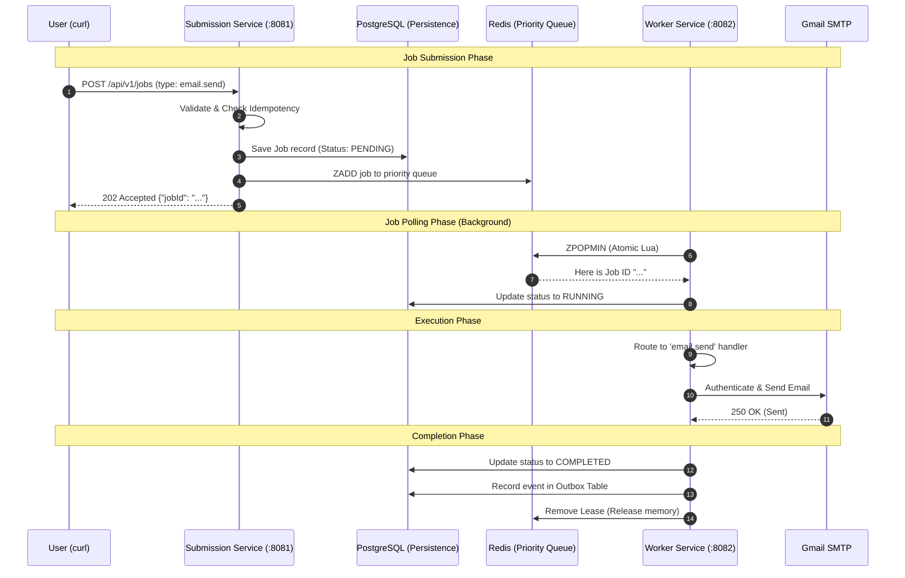

# Distributed Job Scheduler - System Walkthrough

This document explains exactly how the system works and proves that it is truly a **Distributed Job Scheduler**, not just a simple API wrapper.

## The Big Picture
When you run the `curl` command, you aren't sending an email directly. You are **scheduling a job**. The actual work happens seconds later in a completely different background process.

### 1. Asynchronous Execution
When you hit `POST /api/v1/jobs`, the server responds with `202 Accepted` and a `jobId` almost instantly. At that moment, **no email has been sent yet**. The job is sitting in a queue.

### 2. Resilience
If you turn off your internet or stop the `worker-service` right after the `curl`, the job stays safely in Redis/Postgres. It will be processed the moment the worker comes back online. A direct script would just fail.

### 3. Distributed Safety (Leasing)
The system is built to run 10 or 100 workers at once. We use **Atomic Lua Scripts** in Redis to ensure that even if 100 workers check the queue at the exact same millisecond, **only one** will ever send the email.

---

## The Lifecycle of a Job (Sequence Diagram)

---

## Detailed Step-by-Step

### 1. Submission Service (:8081)
The "Frontend" of our system. Its only job is to be fast and reliable.
- It receives your JSON.
- It stores a "source of truth" copy in **PostgreSQL**.
- It puts a "ticket" (the Job ID) into **Redis**. We use a **Sorted Set** so that Priority 1 jobs always jump to the front of the line.

### 2. Redis Queue
This is the "Waiting Room". Jobs sit here until a worker is free. Because it's in memory, it can handle thousands of job submissions per second.

### 3. Worker Service (:8082)
This is the "Brain" where the real work happens.
- **Polling**: It asks Redis every 100ms: "Is there anything for me to do?"
- **Leasing**: To prevent two workers from sending the same email, it "leases" the job. If the worker dies mid-email, the lease expires and the job is put back for another worker to try.
- **Execution**: It looks at the `type` (e.g., `email.send`) and calls the correct Java function.

### 4. Reliability & Retries
What if Gmail is down?
- The Worker catches the error.
- It doesn't give up. It calculates an **Exponential Backoff** (e.g., wait 5s, then 20s, then 1m).
- It updates the status to `RETRY` and schedules itself to try again later.

---

## How to Verify It Yourself
You can actually "see" the delay and the queueing:
1.  **Stop the worker**: `./start-all.sh --stop`
2.  **Submit a job**: Run the `curl` command.
3.  **Check Status**: `curl http://localhost:8081/api/v1/jobs/{ID}`. It will say `PENDING`.
4.  **Start the worker**: Now start the worker service (`./start-all.sh`).
5.  **Watch Logs**: Run `tail -f logs/worker-service.log`. You will see the worker wake up, see the old job, and process it immediately.
